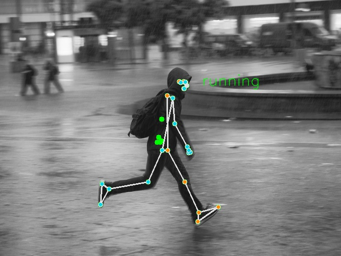

# Running motion detection

"Running in rain", by Sascha Kohlmann, CC BY-SA 2.0, retrieved from [flickr](https://www.flickr.com/photos/skohlmann/24915873875/in/photostream/)

## Background

Very often we will see someone running, trying to catch the bus, which always remind me the game Umamusume (ウマ娘) (賽馬娘)

It led to the idea of this project, what if we can detect if someone is running, and play the game theme song automatically? It would be funny. And here it is.

Sadly the current program only allow detection of 1 person using mediapipe's pose estimation method. I have tried other multi-person pose estimation models, but the output is not very accurate.

This repo is a rework of my existing running detection, I started a new repo due to the following reasons:

- The original repo contains mp3 and .tflite files that might have copy right issues.
- The original implementation uses mediapipe pose estimation -> SVM for action classification. It didn't consider the potential change into YOLO pose estimation -> LSTM classification. It is easier for me to start over, with some code reuse.

## Conclusion

- RNN models tends to have gradient explode/vanish issue, I switched to LSTM
- The dataset I used is not very diverse, and the 'running' is a sprint, not dash, which also made the model harder to train.

## Demo videos
[Running detection demo, using Ultralytics pose estimation and LSTM](https://www.youtube.com/watch?v=tkHygnV7M2M)